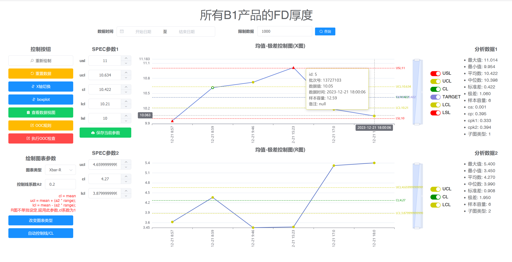
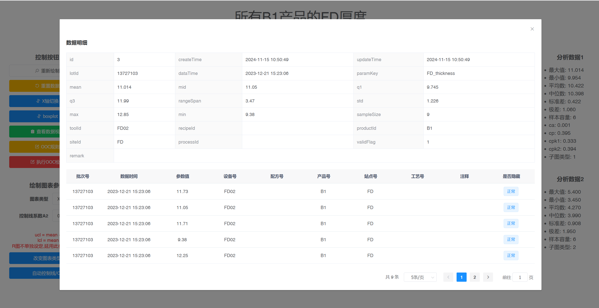
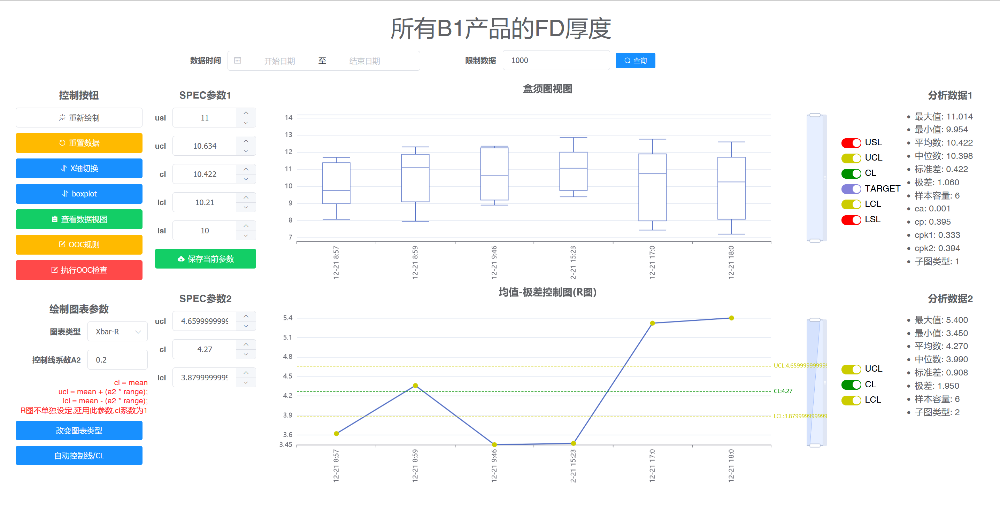

### 基于ruoyi框架二次开发的基础SPC系统
1. 用于执行数据分析
2. 前后端分离,前端项目参见同目录仓库

#### 支持以下功能:
| 功能           | 说明 |
|--------------|------|
| 数据过滤与筛选，条件选择 | 含批次号、设备号、配方号、产品号、站点号、工艺号、时间以及分页限制 |
| 图表绘制         | Xbar-R、Xbar-S、Xmedian-R |
| 图表动态参数控制     | 动态切换图表类型；自动控制线计算，即自动计算ucl、lcl值；自定义控制线以及存储入库； |
| 常用分析数据计算     | ca、cp、cpk、中位数、标准差、q1、q3等 |
| 绘制控制         | 实时重绘；x轴基于时间/lot切换；数据视图； |
| 图表数据点控制      | 查看原始数据；隐藏点；注释点；删除点 |
| 动态切换到盒须图分布   |      |
| 支持常见的8种OOC检查 |      |
##### 控制图页面

#### 原始数据

#### 盒须图视图

#### 导入数据库
1. 数据库脚本在/db 目录下,导入到数据库后修改连接;
2. 数据库建议创建字符集:utf8mb4 排序:utf8mb4_general_ci
3. 请使用mysql8 ,57有一些语法不支持

#### 默认账号密码
admin/123qweASD


#### 示例数据
1. doc目录下有示例上传的xlsx
2. 数据库脚本已经预置了文件里的数据,不需要再重新上传
3. 支持接口导入,和xlsx两种方案导入,格式符号即可
4. 示例数据展示了FD的厚度的量测数据,来源于机台FD01和FD02,且FD01制程稳定性由于FD02.每次检测采样点9个.

#### 需要配置通知邮件的话,在配置文件上填写
1. 收件人配置在了代码中,见方法:
> com.ruoyi.project.util.MailUtil.sendMail
```yaml
mail:
    enable: false
    host: smtp.qiye.aliyun.com
    username: tomcat@abc.com
    password: 123456
```

## TODO
1. 有一些页面的搜索条件还没完善,重点落在图的绘制上
2. 数据的存储方案不太好,后面可能要修改
3. 参数组的联动还没做,得手动填写参数key,以及规格线
4. 盒须图视图的上下限范围有点难以确定,可以依据具体情况修改yAxis的max,min值确定,最好的方案是基于实际数据矩阵值来
5. CL和target的关系需要理一下
6. 当详情页没有指定ooc时,图绘制页面无法打开ooc规则配置页